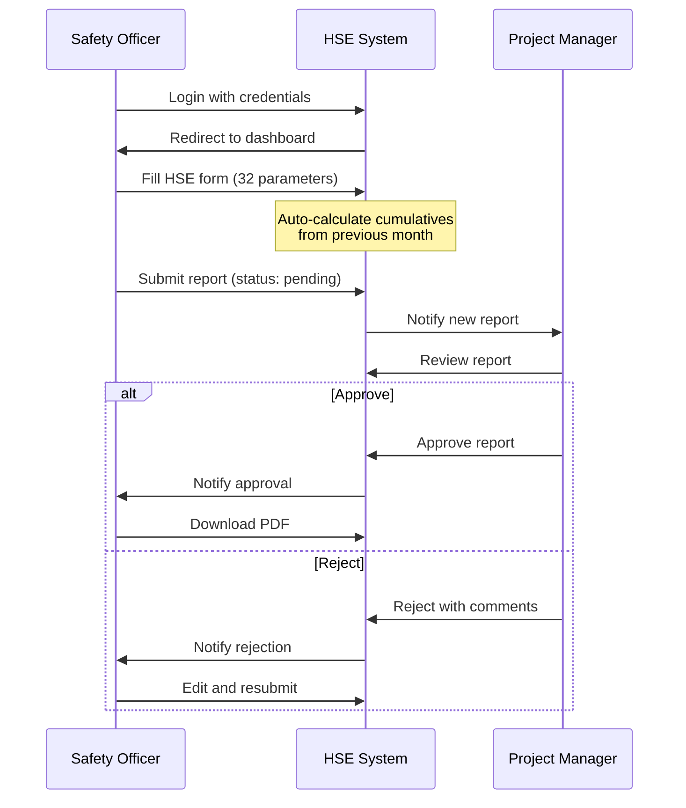

## Project Overview

The HSE (Health, Safety & Environment) module is a **Flask-based monthly reporting system** designed for SIMON India Limited.  
It enables Safety Officers, Project Managers, and Admins to collaborate on HSE performance monitoring with:

- **Role-based access control** (Admin, Safety Officer, Project Manager)
- **Dynamic form configuration** (Prepared By, Approved By, Contractors)
- **Approval workflows** with comments and notifications
- **Cumulative calculations** for 32 monitoring parameters
- **PDF report generation** for approved reports

**Technology stack**: Flask 3.x, MySQL, WeasyPrint, Flask-Session, Tailwind CSS.

---

## User Roles & Workflows

### Roles

| Role | Responsibilities | Access |
|------|------------------|--------|
| Safety Officer | Fill monthly HSE reports with 32 monitoring parameters, edit rejected reports, download approved PDFs | Report form, personal dashboard, notifications |
| Project Manager | Review pending reports, approve/reject with comments, view all reports | Review dashboard, approval interface, report filters |
| Admin | Manage users (Safety Officers, Project Managers), configure dropdowns (Prepared By, Approved By, Contractors), view system stats | Admin dashboard, user management, configuration management |

### High-Level Workflow



---

## Setup Instructions

### Prerequisites

- **Python**: 3.8 or higher  
- **Database**: MySQL 5.7+ or MariaDB 10.3+  
- **WeasyPrint system dependencies**:
  - Cairo
  - Pango
  - GDK-Pixbuf

### Step 1: Navigate to HSE Module

```bash
cd "d:\Digital Transformation\SIL_Forms\HSE"
```

### Step 2: Install System Dependencies for WeasyPrint

**Windows**

- Download and install the GTK3 runtime from  
  `https://github.com/tschoonj/GTK-for-Windows-Runtime-Environment-Installer`
- Alternatively, use prebuilt WeasyPrint binaries (refer to comments in `requirements.txt` if present).

**Linux (Ubuntu/Debian)**

```bash
sudo apt-get update && sudo apt-get install -y \
    libcairo2 libpango-1.0-0 libgdk-pixbuf2.0-0 \
    libffi-dev shared-mime-info
```

### Step 3: Install Python Dependencies

```bash
pip install -r requirements.txt
```

### Step 4: Configure Environment Variables

1. Copy the example file:

   ```bash
   copy .env.example .env   # On Windows (PowerShell/CMD)
   # or
   cp .env.example .env     # On Linux/macOS
   ```

2. Edit `.env` and set:
   - `DB_HOST`, `DB_USER`, `DB_PASSWORD`, `DB_NAME`, `DB_PORT`
   - `SECRET_KEY` (generate a secure value)
   - `ADMIN_EMAIL`, `ADMIN_PASSWORD`

3. Generate a secure `SECRET_KEY`:

   ```bash
   python -c "import secrets; print(secrets.token_hex(32))"
   ```

4. **Important**: Change `ADMIN_PASSWORD` from its default value before going to production.

### Step 5: Initialize the Database

```bash
python init_database.py
```

This script will:

- Create the `hse_reports_db` database if it does not exist
- Create tables: `users`, `hse_reports`, `admin_config`
- Seed:
  - 5 default users (1 admin, 2 safety officers, 2 project managers)
  - Configuration data (prepared_by profiles, approved_by profiles, 11 contractors)
- Display default credentials in the console

### Step 6: Run the Application

```bash
python app.py
```

Open `http://localhost:5000` in your browser.  
Unauthenticated users are redirected to the login page.

---

## Default Credentials

The database initialization seeds the following default users:

| Email | Role | Full Name | Default Password |
|-------|------|-----------|------------------|
| admin@simonindia.ai | Admin | System Administrator | Simon@54321 |
| safety1@simonindia.ai | Safety Officer | Rajesh Kumar | Simon@54321 |
| safety2@simonindia.ai | Safety Officer | Priya Sharma | Simon@54321 |
| pm1@simonindia.ai | Project Manager | Biswa Ranjan Dash | Simon@54321 |
| pm2@simonindia.ai | Project Manager | Anupam Naik | Simon@54321 |

**⚠️ Security Warning**:  
Change all default passwords immediately after the first login and share new credentials securely with respective users.

---

## Application Structure

```text
HSE/
├── app.py                          # Main Flask application (routes, APIs, auth, business logic)
├── init_database.py                # Database initialization & seeding
├── requirements.txt                # Python dependencies
├── .env                            # Environment variables (not committed)
├── .env.example                    # Environment template
├── README.md                       # HSE module documentation (this file)
├── flask_session/                  # Server-side session storage directory
└── templates/
    ├── login.html                  # Login page (landing page)
    ├── admin_dashboard.html        # Admin overview with statistics
    ├── admin_config.html           # Manage dropdowns (prepared_by, approved_by, contractors)
    ├── admin_users.html            # User management (CRUD)
    ├── hse_form.html               # Monthly HSE report form (32 parameters)
    ├── safety_officer_dashboard.html   # Safety Officer reports list with status
    ├── project_manager_dashboard.html  # PM review queue with filters
    ├── review_report.html          # Read-only report view for approval
    └── report_pdf.html             # PDF template for approved reports
```

---

## HSE Report Parameters

The system tracks 32+ monitoring parameters, split into **numeric** and **yes/no** categories.  
Numeric parameters maintain both current period values and cumulative totals; yes/no parameters store only the current period value.

### Numeric Parameters (1–26)  
Current period value **+** cumulative calculation:

1. Staff/Workmen count  
2. Safe Manhours  
3. Induction training sessions  
4. HSE meetings conducted  
5. HSE awareness programs  
6. Toolbox talks  
7. Fatalities  
8. Other LTI (Lost Time Injuries)  
9. Non-disabling injuries  
10. First aid cases  
11. Near miss incidents  
12. Dangerous occurrences  
13. Unsafe acts observed  
14. Disciplinary actions  
15. Mandays lost  
16. LTI-free days  
17. Frequency rate  
18. Severity rate  
19. JSA/HIRA conducted  
20. Incentives awarded  
21. Penalties imposed  
22. Audits completed  
23. Pending non-conformances  
24. Compensation cases raised  
25. Compensation cases resolved  
26. Vehicular accidents  
27. Fire/explosion incidents  

### Yes/No Parameters (27–33)  
Current period value only:

28. Workmen compensation policy active  
29. Compensation policy valid  
30. ESI registered  
31. HIRAC register maintained  
32. Environment register maintained  
33. Legal register maintained  

### Cumulative Calculation Logic

For numeric parameters, the system automatically calculates cumulative values as:

\[
\text{cumulative}_{\text{current}} =
\text{cumulative}_{\text{previous}} + \text{current\_period\_value}
\]

- The previous month’s **approved** report provides the last cumulative values.  
- When a new report is created, the system fetches the latest approved report for that location/contractor and pre-fills cumulative fields accordingly.

---

## API Endpoints

### Authentication

- **POST `/login`**  
  User login with email/password. Returns JSON with `success` flag and a role-based `redirect` URL.

- **POST `/logout`**  
  Clears the user session and logs the user out.

- **GET `/api/auth/status`**  
  Returns current login status and basic user info (e.g., role, name).

- **GET `/api/auth/csrf-token`**  
  Returns a CSRF token to be used in all state-changing requests via `X-CSRF-Token` header.

### Admin Management

- **GET `/api/admin/stats`**  
  Returns dashboard statistics for Admin (report counts, status distribution, etc.).

- **GET `/api/admin/config/<type>`**  
  Get configuration entries by type: `prepared_by`, `approved_by`, `contractor`.

- **POST `/api/admin/config/<type>`**  
  Create a new configuration entry for the given type.

- **PUT `/api/admin/config/<type>/<id>`**  
  Update an existing configuration entry.

- **DELETE `/api/admin/config/<type>/<id>`**  
  Delete a configuration entry (only if safe to do so).

- **GET `/api/admin/users`**  
  List all non-admin users with their roles and basic details.

- **POST `/api/admin/users`**  
  Create a new user (Safety Officer or Project Manager).

- **PUT `/api/admin/users/<id>`**  
  Update user details (name, email, role, etc.).

- **DELETE `/api/admin/users/<id>`**  
  Delete a user, with safety checks to prevent deletion if associated reports exist.

### HSE Reports

- **GET `/api/hse/config`**  
  Returns dropdown options: prepared_by profiles, approved_by profiles, contractors.

- **GET `/api/hse/previous_month`**  
  Returns previous month’s cumulative values for auto-calculation.

- **POST `/api/hse/submit`**  
  Submit a new HSE report:
  - Initial status: `pending`
  - Auto-calculates cumulative fields for numeric parameters.

- **PUT `/api/hse/update/<id>`**  
  Update a rejected report (Safety Officer can edit and resubmit).

- **GET `/api/hse/reports`**  
  List reports for the currently logged-in user (Safety Officer or PM).

- **GET `/api/hse/report/<id>`**  
  Retrieve details of a specific HSE report.

- **GET `/api/hse/pending_reports`**  
  List all pending reports for review (Project Manager only).

- **POST `/api/hse/approve/<id>`**  
  Approve a report (Project Manager only). Triggers notification and allows PDF download.

- **POST `/api/hse/reject/<id>`**  
  Reject a report with a comment (Project Manager only).  
  Safety Officer can then edit and resubmit.

- **GET `/api/hse/download/<id>`**  
  Download an approved report as PDF (WeasyPrint-based).

### Notifications

- **GET `/api/hse/notifications`**  
  Get notifications for the currently logged-in user.

- **POST `/api/hse/notifications/mark_read`**  
  Mark notifications as read.

---

## Database Schema

### `users` Table

- `id` (INT, PK, AUTO_INCREMENT)  
- `username` (VARCHAR(100), UNIQUE, NOT NULL)  
- `email` (VARCHAR(150), UNIQUE, NOT NULL)  
- `password_hash` (VARCHAR(255), NOT NULL) — PBKDF2:SHA256  
- `role` (ENUM: `admin`, `safety_officer`, `project_manager`)  
- `full_name` (VARCHAR(150), NOT NULL)  
- `designation` (VARCHAR(100))  
- `profile_pic` (VARCHAR(255))  
- `created_at` (TIMESTAMP)  

### `hse_reports` Table

- `id` (INT, PK, AUTO_INCREMENT)  
- `report_number` (VARCHAR(50), UNIQUE, NOT NULL)  
- `month` (VARCHAR(20), NOT NULL)  
- `year` (INT, NOT NULL)  
- `name_of_work` (VARCHAR(255), NOT NULL)  
- `wo_number` (VARCHAR(100))  
- `contractor_name` (VARCHAR(150), NOT NULL)  
- `status_date` (DATE, NOT NULL)  
- `prepared_by_id` (INT, FK to `users.id`)  
- `approved_by_id` (INT, FK to `users.id`, nullable)  
- `status` (ENUM: `draft`, `pending`, `approved`, `rejected`)  
- `rejection_comment` (TEXT)  
- `report_data` (JSON) — Stores all 32+ parameters  
- `created_at` (TIMESTAMP)  
- `updated_at` (TIMESTAMP)  

**Indexes**:

- On `status`  
- On `(month, year)`  
- On `prepared_by_id`  
- On `approved_by_id`  
- On `contractor_name`

### `admin_config` Table

- `id` (INT, PK, AUTO_INCREMENT)  
- `config_key` (VARCHAR(100), UNIQUE, NOT NULL)  
- `config_value` (TEXT, NOT NULL) — JSON for profiles, plain text for contractors  
- `config_type` (VARCHAR(50), NOT NULL) — `prepared_by`, `approved_by`, `contractor`  
- `description` (VARCHAR(255))  
- `created_at` (TIMESTAMP)  

**Index**:

- On `config_type`

---

## Security Considerations

- **Password Hashing**  
  Uses Werkzeug’s PBKDF2:SHA256 with per-password salt.

- **Session Management**  
  Server-side filesystem sessions with a default inactivity timeout of **30 minutes**.

- **CSRF Protection**  
  Token-based CSRF protection for all state-changing endpoints.  
  Frontend must send the token via the `X-CSRF-Token` header.

- **SQL Injection Prevention**  
  All database operations use parameterized queries.

- **Role-Based Access Control**  
  Decorators enforce role-based permissions on sensitive routes and APIs.

- **Input Validation**  
  Server-side validation of all form and API payloads before database operations.

- **Database Constraints**  
  Foreign keys, unique constraints, and enums maintain data integrity.

### Production Recommendations

1. Use **Redis** or another external store for session storage instead of filesystem.  
2. Enable **HTTPS** with a valid SSL certificate.  
3. Set `app.debug = False` in production.  
4. Use environment-specific `.env` files (dev, staging, prod).  
5. Implement **rate limiting** on the `/login` endpoint.  
6. Schedule **regular database backups**.  
7. Monitor the `flask_session/` directory size and clean up old sessions.  
8. Rotate `SECRET_KEY` periodically following a proper key rotation strategy.  
9. Enforce strong **password complexity** requirements.  
10. Add **audit logging** for logins, approvals, rejections, and user management actions.

---

## Troubleshooting

### Database Connection Errors

- Verify MySQL is running:

  ```bash
  mysql -u root -p
  ```

- Check that `.env` credentials (`DB_HOST`, `DB_USER`, `DB_PASSWORD`, `DB_NAME`, `DB_PORT`) are correct.  
- Ensure the MySQL user has **CREATE DATABASE** and **CREATE TABLE** privileges.  
- Confirm firewall rules allow access to port `3306` (or your custom `DB_PORT`).  
- Review `init_database.py` console output for detailed error messages.

### Login Issues

- Clear browser cookies and cache, then try again.  
- Verify that the user exists in the `users` table:

  ```sql
  SELECT * FROM users WHERE email = 'your@email.com';
  ```

- For seeded users, confirm that the default password is **`Simon@54321`**.  
- Ensure the `flask_session/` directory is writable by the application.  
- Check the browser console for JavaScript errors on the login page.  
- Confirm that CSRF token requests (`/api/auth/csrf-token`) are succeeding.

### PDF Generation Fails

- Verify that WeasyPrint system dependencies (Cairo, Pango, GDK-Pixbuf) are installed.  
- Ensure the report status is **`approved`** (only approved reports can be downloaded).  
- Check Flask logs for WeasyPrint-related exceptions.  
- Test WeasyPrint installation:

  ```bash
  python -c "import weasyprint; print(weasyprint.__version__)"
  ```

### Cumulative Calculations Incorrect

- Verify the previous month’s report exists and has status `approved`.  
- Check that `report_data` JSON structure matches the expected parameter keys.  
- Review the cumulative calculation helper function in `init_database.py`.  
- Ensure month naming/normalization is consistent (e.g., `"January"` vs `"january"`).

### Session Timeout Issues

- Default session timeout is **30 minutes** (1800 seconds).  
- Adjust `PERMANENT_SESSION_LIFETIME` in `app.py` if needed.  
- Clear the `flask_session/` directory if sessions appear corrupted or stuck.

### Form Not Loading Dropdowns

- Check that `/api/hse/config` returns data (use browser dev tools / Network tab).  
- Ensure `admin_config` table is properly seeded by `init_database.py`.  
- Verify the user is authenticated (API requires a valid session).  
- Check browser console for fetch or CORS errors.

---

## Development Notes

### Adding New HSE Parameters

1. Update the cumulative calculation logic (e.g., `calculate_cumulative_values()` in `init_database.py`).  
2. Add the parameter key to the appropriate list (`numeric_keys` or `yes_no_keys`).  
3. Update `hse_form.html` to include new input controls.  
4. Update `report_pdf.html` to show the new parameters in the PDF.  
5. No schema changes are required because parameters are stored in JSON (`report_data`).

### Adding New User Roles

1. Add the new role to the `users.role` ENUM in `init_database.py`.  
2. Implement a role-specific decorator in `app.py` (for example, `@require_new_role`).  
3. Add a dashboard route and corresponding template for the new role.  
4. Update login redirect logic in `app.py` so new role users land on the correct dashboard.

### Customizing Notifications

- Notifications are stored in a JSON-based location (e.g., `notifications.json` in the HSE directory).  
- Automatic pruning removes notifications older than 48 hours (configurable in `app.py`).  
- To add new notification types, extend the notification helper (e.g., `add_notification()`).

---

## License & Support

This application is developed for **internal use by SIMON India Limited**.  
For support or feature requests, please contact the **SIMON India IT Department** through the standard internal channels.

**Version**: 1.0.0  
**Last Updated**: December 2025  
**Maintained By**: SIMON India IT Team  


